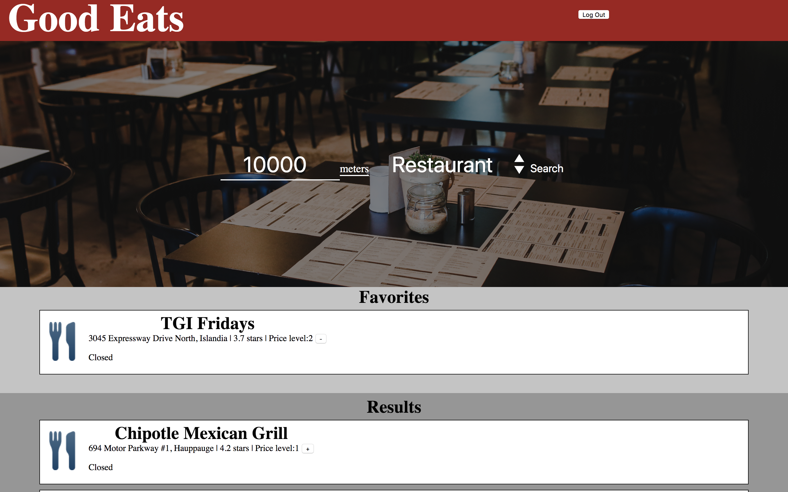
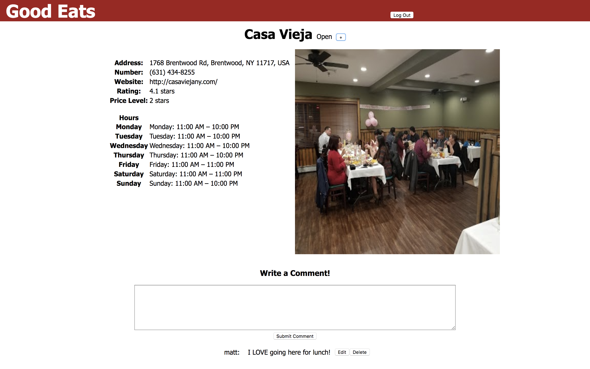

# GoodEats
An application that allows users to discover new restaurants and bars based on their current location

[Click here to view the backend of GoodEats](https://github.com/MarvinClerge/GoodEats-Backend)

## Motivation
The goal behind this application was to refine my web development skills in the following areas:
* Creating a React application
* Geolocation to provide users experiences based on their location 
* JWT authentication and authorization
* Working with Google APIs
* Creating responsive pages

## Tech/framework used
#### React.js
Used to create frontend, manage application state, user interface, DOM manipulation, and fetching data from backend AP.
#### Ruby on Rails
Used to create backend JSON API.
#### PostgreSQL
Used to store and manage user information.
#### GooglePlaces
Used to obtain and display information about restaurants and bars to users.

## Installation
In order to use this application ruby and node js must be installed
### MAC OS
1. Download both the frontend and backend of GoodEats
2. Go to the backend folder location in your terminal and run `bundle install`
3. After the installation is complete run `rails db:migrate` and `rails db:seed` to create the database
4. Run `rails s -p 3001` to start the backend rails server
5. Go to the frontend folder location in your terminal
6. Run `npm install` to install required node packages
7. Run `npm start` to start the frontend server
8. Go to http://localhost:3000 in your browser

## How to use?
After installation this application offers a variety of activities. Below are the myriad of things you can do:

#### Search
In the center of the home pageis the search section. Users can use this to search for nearby locations by distance in meters and type of location.

#### Login
In the top right corner of the home page is the  login section. Here a user can create an account or login. Once logged in a user will have the ability to favorite and comment on locations.

#### Places
After a search in the main page the results will appear as cards below. Click on a card to be taken to the locations page and view more information.

#### Comment
Users can comment on a location in its page.

## Screenshots

## License
MIT License

Copyright (c) 2018 Marvin Clerge

Permission is hereby granted, free of charge, to any person obtaining a copy
of this software and associated documentation files (the "Software"), to deal
in the Software without restriction, including without limitation the rights
to use, copy, modify, merge, publish, distribute, sublicense, and/or sell
copies of the Software, and to permit persons to whom the Software is
furnished to do so, subject to the following conditions:

The above copyright notice and this permission notice shall be included in all
copies or substantial portions of the Software.

THE SOFTWARE IS PROVIDED "AS IS", WITHOUT WARRANTY OF ANY KIND, EXPRESS OR
IMPLIED, INCLUDING BUT NOT LIMITED TO THE WARRANTIES OF MERCHANTABILITY,
FITNESS FOR A PARTICULAR PURPOSE AND NONINFRINGEMENT. IN NO EVENT SHALL THE
AUTHORS OR COPYRIGHT HOLDERS BE LIABLE FOR ANY CLAIM, DAMAGES OR OTHER
LIABILITY, WHETHER IN AN ACTION OF CONTRACT, TORT OR OTHERWISE, ARISING FROM,
OUT OF OR IN CONNECTION WITH THE SOFTWARE OR THE USE OR OTHER DEALINGS IN THE
SOFTWARE.
